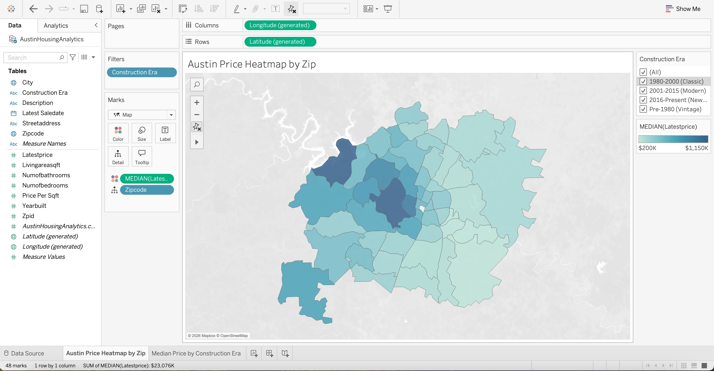
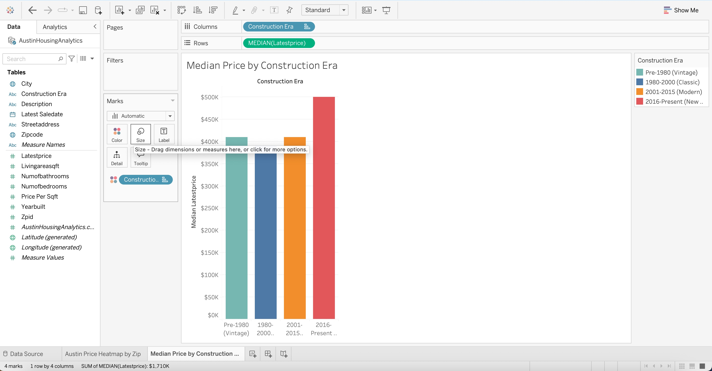

# Austin Housing Market Analysis (End-to-End ELT)

## Project Objective
Analyzed 15,000+ Austin real estate listings to identify price premiums across different construction eras using a modern data stack.

## Tech Stack
- **Python (Pandas/Regex):** Automated data cleaning and delimiter collision resolution.
- **Snowflake:** Cloud Data Warehousing, Stage/File Format management, and SQL transformation.
- **Tableau:** Geospatial heatmaps and interactive market trend dashboards.

## Key Features
### 1. Automated Data Cleaning (Python)
Resolved "delimiter collision" issues where nested commas in property descriptions broke CSV columns. Used **Regex** to sanitize strings before ingestion.

### 2. SQL Transformations (Snowflake)
- **Deduplication:** Utilized 'ROW_NUMBER()' window functions to remove duplicate listings.
- **Feature Engineering:** Classified properties into "Construction Eras" and calculated 'Price_Per_SqFt'.

### 3. Data Visualization (Tableau)
- Built a **Geospatial Heatmap** to identify high-value zip codes.
- Created an **Era Analysis** showing that homes built post-2016 command a significant market premium.

## 📊 Visuals

